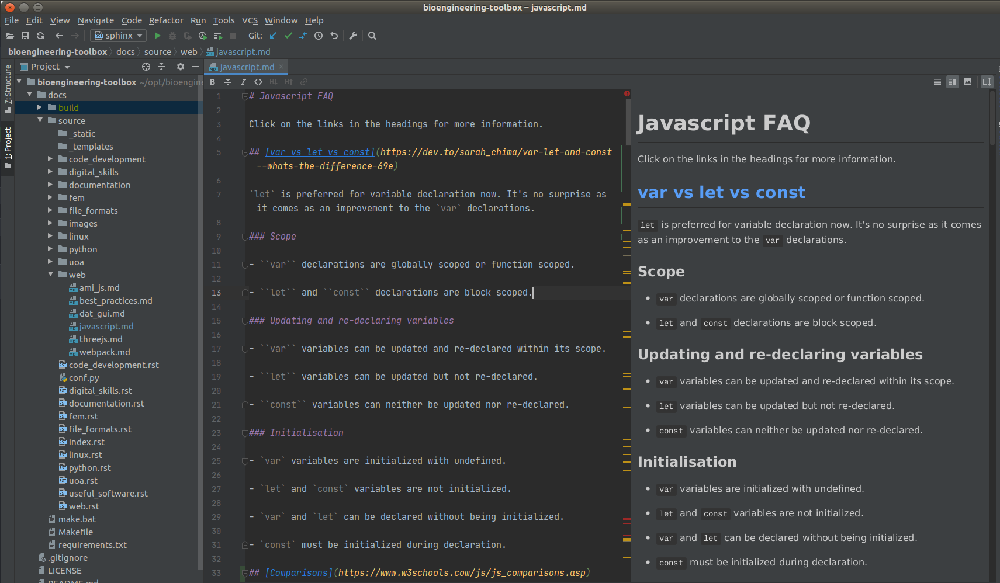

This section describes how sphinx documentation can be created for your
project. Typically this documentation would be generated within a code
repository.

## 1. Setting up a Sphinx project
### 1.1. From scratch
Follow the quick-start instructions on the [official sphinx documentation page](https://docs.readthedocs.io/en/stable/intro/getting-started-with-sphinx.html#quick-start)
During this process, it will ask `Separate source and build directories (y/n)`.
Select yes.

You can now add new reST source files and place them in the `docs/source` folder.
Add the filenames of these new source file to the `index.rst` file in the `docs/source` folder.

### 1.2. Using a template (TBC)


## 2. Building Sphinx documentation

### 2.1. From the command line
Change directory to the folder where the sphinx documentation was generated
(typically `/path/to/docs/`) in the terminal, and run the following command:
```bash
make html
```

### 2.2. Using Pycharm (recommended)

This section describes how to add a sphinx build configuration to PyCharm:
1. Open Pycharm.
2. File -> Open -> Navigate to your project folder -> Click Ok.
3. Run -> Edit configurations.
4. Click the + button and selected `python docs` -> `sphinx` and complete the
following fields:
    1. Name: `Sphinx`
    2. Input: Select the source directory in the documentation folder
    3. Output: Select the build directory in the documentation folder
    4. Python interpreter: Select your interpreter
    5. Options: `-E -a` (This options forces rebuild of html)
5. Click ok.

Note that Python provides a markdown plugin that allows for dynamic previewing of markdown files as shown in the figure below: .

> **_WARNING:_**  On occasion, a bug in the extension results very high CPU usage, slowing down the performance of PyCharm. To address this issue, you need to close any open Markdown files and restart PyCharm. Alternatively, you can disable the Markdown plugin.
